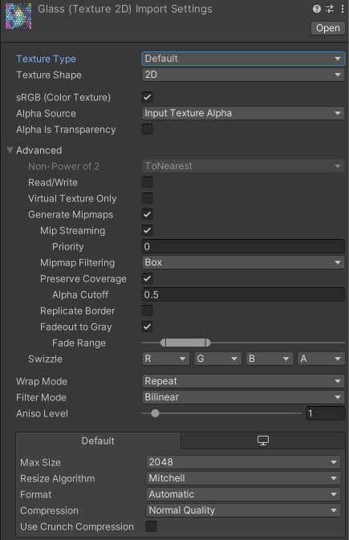
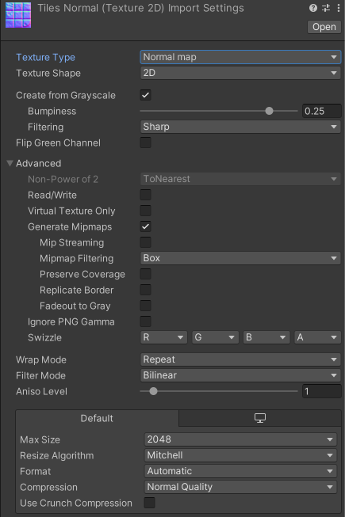
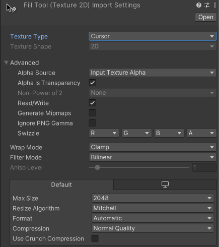
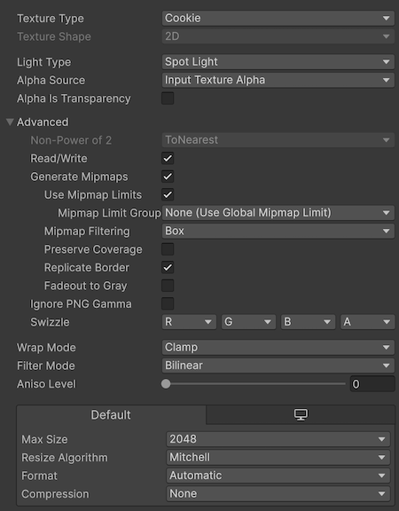
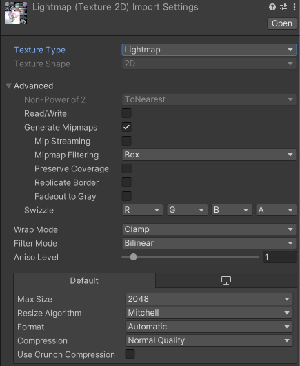

# 1.1.1.3_Unity开发规范
## Unity项目层级结构
考虑到项目会根据需求（如适配多个平台，或开发中途更改底层等），产生多个子工程文件。当同个项目有多个工程文件时，使用罗马数字对项目工程文件进行标识，并在 ***Projects/项目编号/README.txt*** 中进行说明解释。

## 个人电脑层级结构
~~~
|--D盘/E盘
|  |--_Work
|  |  |--Projects
|  |  |  |--项目编号
|  |  |  |  |--U3D_项目编号
|  |  |  |  |--U3D_StepEditor_I ------- // 示例：StepEditor项目I
|  |  |  |  |--U3D_StepEditor_II ------ // 示例：StepEditor项目II
|  |  |  |  |--U3D_HYFT_Project_035_II  // 示例：HYFT_Project_035_II
|  |  |  |  |--README.txt
|  |  |--Library ---------------------- // 库
~~~

## Unity工程文件结构
~~~
|--Assets
|  |--"Project Name"
|  |  |--Command ---------------------- // 项目通用资源
|  |  |  |--Art ----------------------- // 美术资源
|  |  |  |  |--Effects ---------------- // 特效
|  |  |  |  |--Materials -------------- // 材质球
|  |  |  |  |--Objects 
|  |  |  |  |  |--Characters ---------- // 角色
|  |  |  |  |  |  |--#Name# ----------- // 角色名字
|  |  |  |  |  |  |  |--Animations ---- // 角色动画
|  |  |  |  |  |  |  |--Materials ----- // 角色材质球
|  |  |  |  |  |  |  |--Mesh ---------- // 角色网格
|  |  |  |  |  |  |  |--Prefabs ------- // 角色预制体
|  |  |  |  |  |  |  |--Textures ------ // 角色材质
|  |  |  |  |  |--Animals ------------- // 动物
|  |  |  |  |  |--Buildings ----------- // 建筑
|  |  |  |  |  |--Foliage ------------- // 植物
|  |  |  |  |  |--Others -------------- // 其他
|  |  |  |  |  |--Props --------------- // 道具
|  |  |  |  |  |--Vehicles ------------ // 载具
|  |  |  |  |  |--Weapons ------------- // 武器
|  |  |  |  |----PostProcess ---------- // 后处理
|  |  |  |  |----Textures ------------- // 贴图
|  |  |  |  |----UI 
|  |  |  |  |  |--Animations ---------- // UI动画
|  |  |  |  |  |--Fonts --------------- // 字体
|  |  |  |  |  |--Icons --------------- // icon
|  |  |  |  |  |--Sprites ------------- // UI图片
|  |  |  |--Codes
|  |  |  |  |--Scripts
|  |  |  |  |  |--Editor
|  |  |  |  |  |--UI
|  |  |  |  |--Shaders
|  |  |  |--Level
|  |  |  |  |--Prefabs
|  |  |  |  |--Scenes
|  |  |  |---Media
|  |  |  |  |--Audio
|  |  |  |  |--Video
|  |  |  |--RenderTextures
|  |  |  |--Settings
|  |  |  |--Timeline
|  |  |--"ModeA Name"
|  |  |  |..
|  |  |--"ModeB Name"
|  |  |  |..
|  |--_Dev
|  |--Editor
|  |--Plugins
|  |  |--Android
|  |  |--iOS
|  |  |--Special
|  |--Resources
|  |--StreamingAssets
|  |--ScriptTemplates
|  |--ThirdParty                // 第三方插件
~~~

## 场景结构（待优化）
 - 所有空对象位于（0，0，0）处，并具有默认的旋转和比例
 - 对于仅作为脚本容器的空对象，请使用“@”作为前缀
 - 加载实例化对象时，将其放在“_Dynamic”下
 ~~~
 >[--X.X.X--SceneManager--]
>>--@System--
>>--@Debug--
>>--@Management--
>>--@UI--
>>>--Layouts
--Cameras--
--Lights--
|  |--Volumes
--Particles--
--Sound--
--World--
|  |--Global
|  |--Room1
|    |--Architecture
|    |--Terrain
|    |--Props
--Gameplay--
|  |--Actors
|  |--Items
|  |--Triggers
|  |--Quests
.../--_Dynamic--
 ~~~

## 关卡（场景）构成
1. 应有主场景（持久关卡）和子场景的概念。方便多人协作时，能够各自进行不同的工作
2. 主场景的主要功能为：存放通用的资源或代码（即很多个子关卡会使用的资源），并控制子场景的加载/卸载
3. 子关卡分为三类，分别为：序列关卡、环境关卡、光照关卡
4. 序列关卡：用于管理Timeline及其所使用资源，使用”_Cinema”后缀
5. 环境关卡：用于管理环境相关的模型、特效等资源，使用”_Env”后缀
6. 光照关卡：用于管理光照相关的资源，使用”_Light”后缀
7. 当有多个相同类型的子关卡时，在后缀中添加说明，如：光照关卡有白天、黑夜等多个关卡，使用”_Light_Night，_Light_Daytime”进行区分

## C#脚本规范
### Class
### 编译
### 变量
### 函数、事件
### 标识符名称
### 编码约定
> [.NET 编码约定 - C#](https://learn.microsoft.com/zh-cn/dotnet/csharp/fundamentals/coding-style/coding-conventions)
#### 样式指南
一般情况下，对代码示例使用以下格式：
 - 使用四个空格缩进，不要使用编辑器选项卡实现此功能。
 - 一致地对齐代码以提高可读性。
 - 将行限制为 65 个字符，以增强文档上的代码可读性，尤其是在移动屏幕上。
 - 将长语句分解为多行以提高清晰度。
 - 对大括号使用“Allman”样式：左和右大括号另起一行，大括号与当前缩进级别对齐。
 - 如有必要，应在二进制运算符之前换行。

#### 布局约定
好的布局利用格式设置来强调代码的结构并使代码更便于阅读。
 - 使用默认的代码编辑器设置（智能缩进、4 字符缩进、制表符保存为空格）。 有关详细信息，请参阅选项、文本编辑器、C#、格式设置。
 - 每行只写一条语句。
 - 每行只写一个声明。
 - 如果连续行未自动缩进，请将它们缩进一个制表符位（四个空格）。
 - 在方法定义与属性定义之间添加至少一个空白行。
 - 使用括号突出表达式中的子句，如下面的代码所示。
    ~~~
    if ((startX > endX) && (startX > previousX))
    {
        // Take appropriate action.
    }
    ~~~

#### 注释样式
 - 使用单行注释（//）以进行简要说明。
 - 避免使用多行注释（/* */）来进行较长的解释。尽量在配套文章中提供较长的解释。
 - 若要描述方法、类、字段和所有公共成员，请使用 XML 注释。
 - 将注释放在单独的行上，而非代码行的末尾。
 - 以大写字母开始注释文本，在注释分隔符 (//) 与注释文本之间插入一个空格，以句点结束注释文本，如下面的示例所示。
    ~~~
    // The following declaration creates a query. It does not run
    // the query.
    ~~~
 - 如果不能避免使用多行注释，请参考以下示例：
    ~~~
    /**
     * 多行注释
     *
     */
    ~~~

#### 将using指令放在命名空间声明之外
 - 当 using 指令位于命名空间声明之外时，该导入的命名空间是其完全限定的名称。 完全限定的名称更加清晰。 如果 using 指令位于命名空间内部，则它可以是相对于该命名空间的，也可以是它的完全限定名称。
    ~~~
    using Azure;

    namespace CoolStuff.AwesomeFeature
    {
        public class Awesome
        {
            public void Stuff()
            {
                WaitUntil wait = WaitUntil.Completed;
                // ...
            }
        }
    }
    ~~~
#### 字符串数据
#### 数组
#### 委托
#### Try-catch 和 using 语句处理异常

## 资源导入规范
### Texture导入规范
#### 默认导入设置

#### 法线贴图导入设置

#### Sprite(2D and UI)导入设置
导入设置.png)

#### Cursor导入设置

#### Cookie导入设置

#### 光照贴图导入设置
