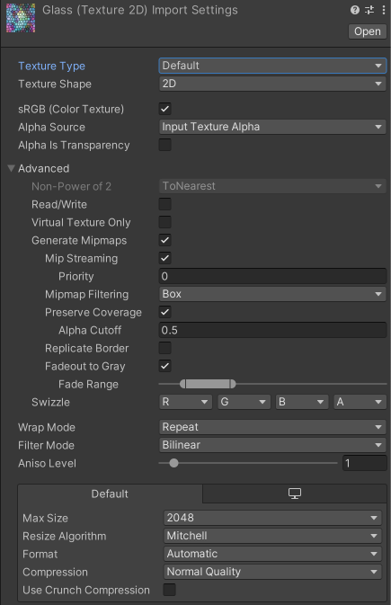
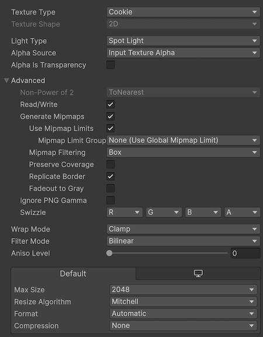

# 1.1.1.3_Unity开发规范
## Unity项目路径
 - 考虑到项目会根据需求（如适配多个平台，或开发中途更改底层等），产生多个子工程文件。
 - 当同个项目有多个工程文件时，使用罗马数字对项目工程文件进行标识，并在 ***Projects/项目编号/README.txt*** 中进行说明解释。
    ~~~
    |--D盘/E盘
    |  |--_Work
    |  |  |--Projects
    |  |  |  |--项目编号
    |  |  |  |  |--U3D_项目编号
    |  |  |  |  |--U3D_StepEditor_I ------- // 示例：StepEditor项目I
    |  |  |  |  |--U3D_StepEditor_II ------ // 示例：StepEditor项目II
    |  |  |  |  |--U3D_HYFT_Project_035_II  // 示例：HYFT_Project_035_II
    |  |  |  |  |--README.txt
    |  |  |--Library ---------------------- // 库
    ~~~

## Unity工程文件结构
~~~
|--Assets
|  |--"Project Name"
|  |  |--Command ---------------------- // 项目通用资源
|  |  |  |--Art ----------------------- // 美术资源
|  |  |  |  |--Effects ---------------- // 特效
|  |  |  |  |--Materials -------------- // 材质球
|  |  |  |  |--Objects 
|  |  |  |  |  |--Characters ---------- // 角色
|  |  |  |  |  |  |--#Name# ----------- // 角色名字
|  |  |  |  |  |  |  |--Animations ---- // 角色动画
|  |  |  |  |  |  |  |--Materials ----- // 角色材质球
|  |  |  |  |  |  |  |--Mesh ---------- // 角色网格
|  |  |  |  |  |  |  |--Prefabs ------- // 角色预制体
|  |  |  |  |  |  |  |--Textures ------ // 角色材质
|  |  |  |  |  |--Animals ------------- // 动物
|  |  |  |  |  |--Buildings ----------- // 建筑
|  |  |  |  |  |--Foliage ------------- // 植物
|  |  |  |  |  |--Others -------------- // 其他
|  |  |  |  |  |--Props --------------- // 道具
|  |  |  |  |  |--Vehicles ------------ // 载具
|  |  |  |  |  |--Weapons ------------- // 武器
|  |  |  |  |----PostProcess ---------- // 后处理
|  |  |  |  |----Textures ------------- // 贴图
|  |  |  |  |----UI 
|  |  |  |  |  |--Animations ---------- // UI动画
|  |  |  |  |  |--Fonts --------------- // 字体
|  |  |  |  |  |--Icons --------------- // icon
|  |  |  |  |  |--Sprites ------------- // UI图片
|  |  |  |--Codes
|  |  |  |  |--Scripts
|  |  |  |  |  |--Editor
|  |  |  |  |  |--UI
|  |  |  |  |--Shaders
|  |  |  |--Level
|  |  |  |  |--Prefabs
|  |  |  |  |--Scenes
|  |  |  |---Media
|  |  |  |  |--Audio
|  |  |  |  |--Video
|  |  |  |--RenderTextures
|  |  |  |--Settings
|  |  |  |--Timeline
|  |  |--"ModeA Name"
|  |  |  |..
|  |  |--"ModeB Name"
|  |  |  |..
|  |--_Dev
|  |--Editor
|  |--Plugins
|  |  |--Android
|  |  |--iOS
|  |  |--Special
|  |--Resources
|  |--StreamingAssets
|  |--ScriptTemplates
|  |--ThirdParty                // 第三方插件
~~~

## 场景结构（待优化）
 - 所有空对象位于（0，0，0）处，并具有默认的旋转和比例
 - 对于仅作为脚本容器的空对象，请使用“@”作为前缀
 - 加载实例化对象时，将其放在“_Dynamic”下
 ~~~
--@System--
--@Debug--
--@Management--
--@UI--
--Layouts
--Cameras--
--Lights--
|  |--Volumes
--Particles--
--Sound--
--World--
|  |--Global
|  |--Room1
|    |--Architecture
|    |--Terrain
|    |--Props
--Gameplay--
|  |--Actors
|  |--Items
|  |--Triggers
|  |--Quests
.../--_Dynamic--
~~~

## 关卡（场景）构成
1. 应有主场景（持久关卡）和子场景的概念。方便多人协作时，能够各自进行不同的工作
2. 主场景的主要功能为：存放通用的资源或代码（即很多个子关卡会使用的资源），并控制子场景的加载/卸载
3. 子关卡分为三类，分别为：序列关卡、环境关卡、光照关卡
4. 序列关卡：用于管理Timeline及其所使用资源，使用”_Cinema”后缀
5. 环境关卡：用于管理环境相关的模型、特效等资源，使用”_Env”后缀
6. 光照关卡：用于管理光照相关的资源，使用”_Light”后缀
7. 当有多个相同类型的子关卡时，在后缀中添加说明，如：光照关卡有白天、黑夜等多个关卡，使用”_Light_Night，_Light_Daytime”进行区分

## 脚本模板
### 如何自定义脚本模板
 - 如果要更改初始脚本，可以修改此处存储的脚本模板
    - Windows：C：\Program Files\Unity\Editor\Data\Resources\ScriptTemplates
    - Mac：/Applications/Unity/Editor/Data/Resources/ScriptTemplates
    - Mac（自 5.2.1f1 起）：/Applications/Unity/Unity.app/Contents/Resources/ScriptTemplates
 - 编辑 81-C# Script-NewBehaviourScript.cs.txt文件
 - 修改模板文件后，请重新启动 Unity 编辑器以应用这些更改。
 - ***注意：*** 
    - 升级 Unity 版本时，模板文件将被覆盖，您需要再次复制这些文件并将其替换为自定义模板。
    - 可以在脚本中更改任何内容，但请记住将 #SCRIPTNAME# 保留在原处。没有它，模板类名将不会更改，并且将生成一个具有不正确类名的新脚本文件。

### 如何在unity project上自定义unity脚本模板
 - 在Assets文件夹下，新建文件夹“ScriptTemplates”
 - 将编辑好的“81-C# Script-NewBehaviourScript.cs.txt”文件放在“ScriptTemplates”文件夹下
 - 修改模板文件后，请重新启动 Unity 编辑器以应用这些更改。

## C#脚本规范
### 编码约定
> [.NET 编码约定 - C#](https://learn.microsoft.com/zh-cn/dotnet/csharp/fundamentals/coding-style/coding-conventions)
#### 样式指南
一般情况下，对代码示例使用以下格式：
 - 使用四个空格缩进，不要使用编辑器选项卡实现此功能。
 - 一致地对齐代码以提高可读性。
 - 将行限制为 65 个字符，以增强文档上的代码可读性，尤其是在移动屏幕上。
 - 将长语句分解为多行以提高清晰度。
 - 对大括号使用“Allman”样式：左和右大括号另起一行，大括号与当前缩进级别对齐。
 - 如有必要，应在二进制运算符之前换行。

#### 布局约定
好的布局利用格式设置来强调代码的结构并使代码更便于阅读。
 - 使用默认的代码编辑器设置（智能缩进、4 字符缩进、制表符保存为空格）。
 - 每行只写一条语句。
 - 每行只写一个声明。
 - 如果连续行未自动缩进，请将它们缩进一个制表符位（四个空格）。
 - 在方法定义与属性定义之间添加至少一个空白行。
 - 使用括号突出表达式中的子句，如下面的代码所示。
    ~~~
    if ((startX > endX) && (startX > previousX))
    {
        // Take appropriate action.
    }
    ~~~
 - 在函数参数之间使用逗号后使用单个空格。例：
    ~~~
    Console.In.Read(mychar, 0, 1);
    ~~~
 - 不要在括号和函数参数之间使用空格；
 - 不要在函数名称和括号之间使用空格；
 - 不要在空括号内使用空格

#### 注释样式
 - 使用单行注释（//）以进行简要说明。
 - 避免使用多行注释（/* */）来进行较长的解释。尽量在配套文章中提供较长的解释。
 - 若要描述方法、类、字段和所有公共成员，请使用 XML 注释。
 - 将注释放在单独的行上，而非代码行的末尾。
 - 以大写字母开始注释文本，在注释分隔符 (//) 与注释文本之间插入一个空格，以句点结束注释文本，如下面的示例所示。
    ~~~
    // The following declaration creates a query. It does not run
    // the query.
    ~~~
 - 如果不能避免使用多行注释，请参考以下示例：
    ~~~
    /**
     * 多行注释
     *
     */
    ~~~

#### 命名空间
 - 使用命名空间来确保类/枚举/接口等的作用域不会与其他命名空间或全局命名空间中的现有范围冲突。
 - 项目应至少使用命名空间的项目名称，以防止与任何导入的第三方资产发生冲突
  - 将using指令放在***命名空间声明之外***
    - 当 using 指令位于命名空间声明之外时，该导入的命名空间是其完全限定的名称。 完全限定的名称更加清晰。 如果 using 指令位于命名空间内部，则它可以是相对于该命名空间的，也可以是它的完全限定名称。
    ~~~
    using Azure;

    namespace CoolStuff.AwesomeFeature
    {
        public class Awesome
        {
            public void Stuff()
            {
                WaitUntil wait = WaitUntil.Completed;
                // ...
            }
        }
    }
    ~~~
 - namespace应按字母顺序排序，但命名空间System.*除外，该命名空间应放在所有其他命名空间的顶部。

#### 摘要
 - 所有的公共功能都应有一个摘要。简单地说，任何具有 Public 访问修饰符的函数都应填写其摘要。
    ~~~
    /// 

    /// Fire agun
    /// 

    public void Fire()
    {
        // Fire the gun.
    }
    ~~~

#### 标识符
 - Class/struct/delegate，使用 Pascal 大小写(“PascalCasing”)
    ~~~
    public class DataService
    {
    }
    public struct ValueCoordinate
    {
    }
    public delegate void DelegateType(string message);
    ~~~
    - class类成员应按顺序排列，并分组为多个部分
        ~~~
        Constant Fields     // 常量
        Static Fields       // 静态
        Fields              // 字段
        Constructors        // 构造函数
        Properties          // 属性
        Events / Delegates  // 事件、委托
        LifeCycle Methods   // 生命周期函数(Awake, OnEnable, OnDisable, OnDestroy)
        Public Methods      // public方法
        Private Methods     // private方法
        Nested types        // 嵌套类型
        ~~~
    - class类每个组内的访问顺序为
        ~~~
        public
        internal
        protected
        private
        ~~~
    - 示例：
        ~~~
        namespace ProjectName
        {
            /// 
  
            /// Brief summary of what the class does
            /// 

            public class Account
            {
            #region Fields
            
            [Tooltip("Public variables set in the Inspector, should have a Tooltip")]
            public static string BankName;
            
            /// 
  
            /// They should also have a summary
            /// 

            public static decimal Reserves;
        
            public string BankName;
            public const string ShippingType = "DropShip";
            
            private float _timeToDie;
            
            #endregion
            
            #region Properties
            
            public string Number {get; set;}
            public DateTime DateOpened {get; set;}
            public DateTime DateClosed {get; set;}
            public decimal Balance {get; set;}
                    
            #endregion
            
            #region LifeCycle
            
            public Awake()
            {
                // ...
            }
            
            #endregion
            #region Public Methods
            
            public AddObjectToBank()
            {
                // ...
            }
            
            #endregion
            }
        }
        ~~~
 - Interface使用 pascal 大小写并在名称前面加上前缀 I
    ~~~
    public interface IWorkerQueue
    {
    }
    ~~~
 - public的命名字段、属性和事件，所有方法和本地函数，使用 Pascal 大小写(“PascalCasing”)
    ~~~
    public class ExampleEvent
    {
        // A public field, these should be used sparingly
        public bool IsValid;

        // An init-only property
        public IWorkerQueue WorkerQueue {get; init;}

        // An event
        public event Action EventProcessing;

        // Method
        public void StartEventProcessing()
        {
            // Local function
            static int CountQueueItems() => WorkerQueue.Count;
            // ...
        }
    }
    ~~~
 - private/internal使用驼峰式大小写（“camelCasing”），并对它们添加 _ 作为前缀。 命名局部变量（包括委托类型的实例）时，请使用驼峰式大小写
    ~~~
    public class DataService
    {
        private IWorkerQueue _workerQueue;
    }
    ~~~
 - private 或 internal 的static 字段,使用 s_ 前缀，对于线程静态，请使用 t_
    ~~~
    public class DataService
    {
        private static IWorkerQueue s_workQueue;

        [ThreadStatic]
        private static TimeSpan t_timeSpan;
    }
    ~~~
 - 方法参数，使用驼峰式大小写
    ~~~
    public T SomeMethod<T>(int someNumber, bool isValid)
    {
    }
    ~~~

#### 函数、事件
 - 所有函数都应该是动词
    - 所有函数和事件都执行某种形式的操作，无论是获取信息、计算数据还是导致某些东西爆炸。因此，所有函数都应以动词开头。它们应尽可能用现在时态措辞。他们还应该了解自己在做什么。
    - 如：Fire、Jump

 - 返回 Bool 的函数应提出问题
    - 当编写一个不改变或修改任何对象的状态，纯粹是为了获取信息、状态或计算是/否值的函数时，它应该提出一个问题。
    - 如：isDead、isOnFire

 - 事件处理程序和调度程序应以On
    - 任何处理事件或调度事件的函数都应以动词规则开头并继续遵循。
    - 如：OnDeath、OnPickup

#### 变量
 - 变量名不与上下文冗余，如：
    ~~~
    public class PlayerCharacter
    {
        public int PlayerScore; // 错误的命名
        public int Score;       // 正确的命名
    }
    ~~~
 - 公有变量，使用PascalCase命名法,且不带前缀
    - 首选使用属性[SerializeField]，而不是公开变量，只有在必要时才应公开变量

 - 私有变量，使用camelCase命名法
    - 私有变量应具有带下划线的前缀，并使用 camelCase。如：_myVariable
    - 除非已知变量只能在定义它的类中访问，而不应该在子类中访问，否则不要将变量标记为私有变量。
    - 请勿在标识符中使用匈牙利符号或任何其他类型标识
    ~~~
    // 正确的
    private int _counter;
    private string _name;

    // 错误的
    private int iCounter;
    private string strName;
    ~~~
 - 局部变量使用camelCase
    ~~~
    public void TestMethed()
    {
        var var1 = "this is string";
        var var2 = 27;
    }
    ~~~
 - 布尔值
    - 以 PascalCase 命名，但以动词为前缀，如：isDead，isFire
    - 如果可能的话，所有布尔值都应该被命名为描述性形容词
    - 不要使用布尔值来表示复杂和/或依赖状态。这使得状态添加和删除变得复杂，不再容易阅读。请改用枚举。如：如果武器不能同时装弹和装备，定义一个WeaponState的变量，而不是定义isReloading、isEquipping

 - 枚举
    - 使用 PascalCase，并为枚举及其值使用单数名称
    - 枚举可以放置在类空间之外，以提供全局访问
    ~~~
    public enum WeaponType
    {
        Knife,
        Gun
    }
    [Flags]
    public enum Dockings
    {
        None = 1;
        Top = 2;
    }
    ~~~
 - 数组
    - 遵循与上述相同的命名规则，但应以复数名词命名，如：使用 Targets、 Hats、EnemyPlayers，
而不是TargetList 、HatArray、EnemyPlayerArray 
 - 接口
    - 接口以大写字母I开头，然后以 PascalCase 开头。如：
    ~~~
    public interface ICanEat { }
    ~~~

#### 字符串数据
 - 使用字符串内插来连接短字符串
    ~~~
    string displayName = $"{nameList[n].LastName}, {nameList[n].FirstName}";
    ~~~
 - 若要在循环中追加字符串，尤其是在使用大量文本时，请使用 System.Text.StringBuilder 对象
    ~~~
    var phrase = "lalalalalalalalalalalalalalalalalalalalalalalalalalalalalala";
    var manyPhrases = new StringBuilder();
    for (var i = 0; i < 10000; i++)
    {
        manyPhrases.Append(phrase);
    }
    //Console.WriteLine("tra" + manyPhrases);
    ~~~

#### 数组
 - 当在声明行上初始化数组时，请使用简洁的语法。 在以下示例中，不能使用 var 替代 string[]。
    ~~~
    string[] vowels1 = { "a", "e", "i", "o", "u" };
    ~~~
 - 如果使用显式实例化，则可以使用 var。
    ~~~
    var vowels2 = new string[] { "a", "e", "i", "o", "u" };
    ~~~

#### 委托
 - 使用 Func<> 和 Action<>，而不是定义委托类型。 在类中，定义委托方法。
    ~~~
    Action<string> actionExample1 = x => Console.WriteLine($"x is: {x}");

    Action<string, string> actionExample2 = (x, y) =>
        Console.WriteLine($"x is: {x}, y is {y}");

    Func<string, int> funcExample1 = x => Convert.ToInt32(x);

    Func<int, int, int> funcExample2 = (x, y) => x + y;
    ~~~
 - 使用 Func<> 或 Action<> 委托定义的签名来调用方法。
    ~~~
    actionExample1("string for x");

    actionExample2("string for x", "string for y");

    Console.WriteLine($"The value is {funcExample1("1")}");

    Console.WriteLine($"The sum is {funcExample2(1, 2)}");
    ~~~
 - 如果创建委托类型的实例，请使用简洁的语法。 在类中，定义委托类型和具有匹配签名的方法。
    ~~~
    public delegate void Del(string message);

    public static void DelMethod(string str)
    {
        Console.WriteLine("DelMethod argument: {0}", str);
    }
    ~~~
 - 创建委托类型的实例，然后调用该实例。
    ~~~
    // 以下声明显示了紧缩的语法
    Del exampleDel2 = DelMethod;
    exampleDel2("Hey");

    // 以下声明使用了完整的语法
    Del exampleDel1 = new Del(DelMethod);
    exampleDel1("Hey");
    ~~~

#### Try-catch 和 using 语句处理异常
 - 对大多数异常处理使用 try-catch 语句
    ~~~
    static double ComputeDistance(double x1, double y1, double x2, double y2)
    {
        try
        {
            return Math.Sqrt((x1 - x2) * (x1 - x2) + (y1 - y2) * (y1 - y2));
        }
        catch (System.ArithmeticException ex)
        {
            Console.WriteLine($"Arithmetic overflow or underflow: {ex}");
            throw;
        }
    }
    ~~~
 - 通过使用 C# using 语句简化你的代码。 如果具有 try-finally 语句（该语句中 finally 块的唯一代码是对 Dispose 方法的调用），请使用 using 语句代替。
    ~~~
    // 在以下示例中，try-finally 语句仅在 finally 块中调用 Dispose。
    Font bodyStyle = new Font("Arial", 10.0f);
    try
    {
        byte charset = bodyStyle.GdiCharSet;
    }
    finally
    {
        if (bodyStyle != null)
        {
            ((IDisposable)bodyStyle).Dispose();
        }
    }

    // 可以使用 using 语句执行相同的操作。
    using (Font arial = new Font("Arial", 10.0f))
    {
        byte charset2 = arial.GdiCharSet;
    }

    // 使用不需要大括号的新 using 语法：
    using Font normalStyle = new Font("Arial", 10.0f);
    byte charset3 = normalStyle.GdiCharSet;
    ~~~

#### && 和 || 运算符 
 - 在执行比较时，使用 && 而不是 &，使用 || 而不是 |，如以下示例所示。
    ~~~
    Console.Write("Enter a dividend: ");
    int dividend = Convert.ToInt32(Console.ReadLine());

    Console.Write("Enter a divisor: ");
    int divisor = Convert.ToInt32(Console.ReadLine());

    if ((divisor != 0) && (dividend / divisor) is var result)
    {
        Console.WriteLine("Quotient: {0}", result);
    }
    else
    {
        Console.WriteLine("Attempted division by 0 ends up here.");
    }
    ~~~

#### new 运算符
 - 使用对象实例化的简洁形式之一，如以下声明中所示。
    ~~~
    var firstExample = new ExampleClass();
    ExampleClass instance2 = new();

    // 前面的声明等效于下面的声明
    ExampleClass secondExample = new ExampleClass();
    ~~~
 - 使用对象初始值设定项简化对象创建，如以下示例中所示
    ~~~
    var thirdExample = new ExampleClass { Name = "Desktop", ID = 37414, Location = "Redmond", Age = 2.3 };

    // 下面的示例设置了与前面的示例相同的属性，但未使用初始值设定项
    var fourthExample = new ExampleClass();
    fourthExample.Name = "Desktop";
    fourthExample.ID = 37414;
    fourthExample.Location = "Redmond";
    fourthExample.Age = 2.3;
    ~~~

#### 事件处理
 - 使用 lambda 表达式定义稍后无需移除的事件处理程序
    ~~~
    public Form2()
    {
        this.Click += (s, e) =>
            {
                MessageBox.Show(
                    ((MouseEventArgs)e).Location.ToString());
            };
    }

    // Lambda 表达式缩短了以下传统定义
    public Form1()
    {
        this.Click += new EventHandler(Form1_Click);
    }
    void Form1_Click(object? sender, EventArgs e)
    {
        MessageBox.Show(((MouseEventArgs)e).Location.ToString());
    }
    ~~~

#### 静态成员
 - 使用类名调用 static 成员：ClassName.StaticMember。 
 - 这种做法通过明确静态访问使代码更易于阅读。 
 - 请勿使用派生类的名称来限定基类中定义的静态成员。 
 - 编译该代码时，代码可读性具有误导性，如果向派生类添加具有相同名称的静态成员，代码可能会被破坏。

#### LINQ 查询
 - 对查询变量使用有意义的名称。 下面的示例为位于西雅图的客户使用 seattleCustomers。
    ~~~
    var seattleCustomers = from customer in customers
                        where customer.City == "Seattle"
                        select customer.Name;
    ~~~
 - 使用别名确保匿名类型的属性名称都使用 Pascal 大小写格式正确大写。
    ~~~
    var localDistributors =
        from customer in customers
        join distributor in distributors on customer.City equals distributor.City
        select new { Customer = customer, Distributor = distributor };
    ~~~
 - 如果结果中的属性名称模棱两可，请对属性重命名。 例如，如果你的查询返回客户名称和分销商 ID，而不是在结果中将它们保留为 Name 和 ID，请对它们进行重命名以明确 Name 是客户的名称，ID 是分销商的 ID。
    ~~~
    var localDistributors2 =
        from customer in customers
        join distributor in distributors on customer.City equals distributor.City
        select new { CustomerName = customer.Name, DistributorID = distributor.ID };
    ~~~
 - 在查询变量和范围变量的声明中使用隐式类型化。 有关 LINQ 查询中隐式类型的本指导会替代适用于隐式类型本地变量的一般规则。 LINQ 查询通常使用创建匿名类型的投影。 其他查询表达式使用嵌套泛型类型创建结果。 隐式类型变量通常更具可读性。
    ~~~
    var seattleCustomers = from customer in customers
                        where customer.City == "Seattle"
                        select customer.Name;
    ~~~
 - 对齐 from 子句下的查询子句，如上面的示例所示。
 - 在其他查询子句前面使用 where 子句，确保后面的查询子句作用于经过缩减和筛选的一组数据。
    ~~~
    var seattleCustomers2 = from customer in customers
                            where customer.City == "Seattle"
                            orderby customer.Name
                            select customer;
    ~~~
 - 使用多行 from 子句代替 join 子句来访问内部集合。 例如，Student 对象的集合可能包含测验分数的集合。 当执行以下查询时，它返回高于 90 的分数，并返回得到该分数的学生的姓氏。
    ~~~
    var scoreQuery = from student in students
                    from score in student.Scores!
                    where score > 90
                    select new { Last = student.LastName, score };
    ~~~

#### 隐式类型本地变量
 - 当变量的类型在赋值右侧比较明显时，对局部变量使用隐式类型。
    ~~~
    var message = "This is clearly a string.";
    var currentTemperature = 27;
    ~~~
 - 当类型在赋值右侧不明显时，请勿使用 var。 请勿假设类型明显来自方法名称。 如果变量类型是 new 运算符、对文本值的显式强制转换或赋值，则将其视为明确的变量类型。
    ~~~
    int numberOfIterations = Convert.ToInt32(Console.ReadLine());
    int currentMaximum = ExampleClass.ResultSoFar();
    ~~~
 - 不要使用变量名称指定变量的类型。 它可能不正确。 请改用类型来指定类型，并使用变量名称来指示变量的语义信息。 以下示例应对类型使用 string，并使用类似 iterations 的内容指示从控制台读取的信息的含义。
    ~~~
    var inputInt = Console.ReadLine();
    Console.WriteLine(inputInt);
    ~~~
 - 避免使用 var 来代替 dynamic。 如果想要进行运行时类型推理，请使用 dynamic
 - 在 for 循环中对循环变量使用隐式类型。
    ~~~
    // 下面的示例在 for 语句中使用隐式类型化。
    var phrase = "lalalalalalalalalalalalalalalalalalalalalalalalalalalalalala";
    var manyPhrases = new StringBuilder();
    for (var i = 0; i < 10000; i++)
    {
        manyPhrases.Append(phrase);
    }
    //Console.WriteLine("tra" + manyPhrases);
    ~~~
 - 不要使用隐式类型化来确定 foreach 循环中循环变量的类型。 在大多数情况下，集合中的元素类型并不明显。 不应仅依靠集合的名称来推断其元素的类型。
    ~~~
    // 下面的示例在 foreach 语句中使用显式类型化
    foreach (char ch in laugh)
    {
        if (ch == 'h')
        {
            Console.Write("H");
        }
        else
        {
            Console.Write(ch);
        }
    }
    Console.WriteLine();
    ~~~
 - 对 LINQ 查询中的结果序列使用隐式类型。
 - 许多 LINQ 查询会导致必须使用隐式类型的匿名类型。
 - 其他查询则会产生嵌套泛型类型，其中 var 的可读性更高。

#### Region
 - #region指令使您能够折叠和隐藏 C# 文件中的代码部分。有选择地隐藏代码的能力使您的文件更易于管理且更易于阅读。
    ~~~
    #region "This is the code to be collapsed"
        Private components As System.ComponentModel.Container;
    #endregion
    ~~~
## 资源导入规范
### Texture导入规范
#### 默认导入设置

#### 法线贴图导入设置

#### Sprite(2D and UI)导入设置
导入设置.png)

#### Cursor导入设置

#### Cookie导入设置

#### 光照贴图导入设置
